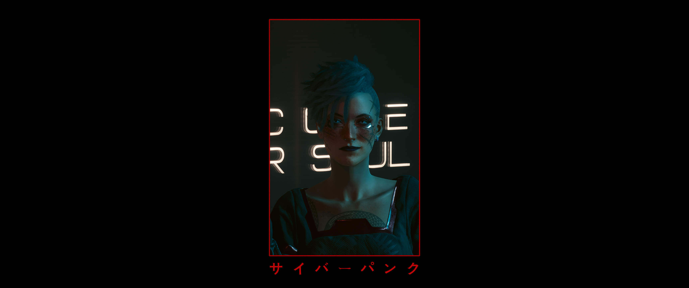
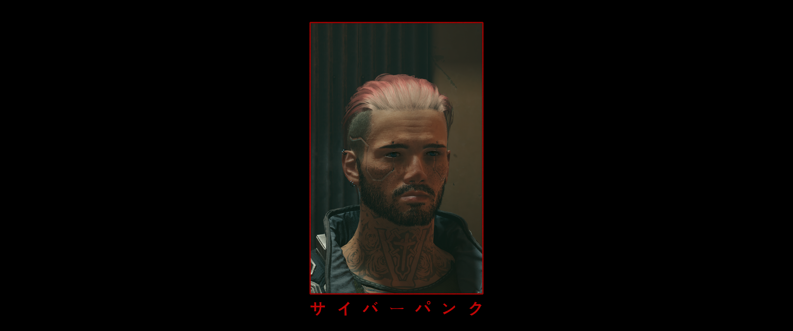
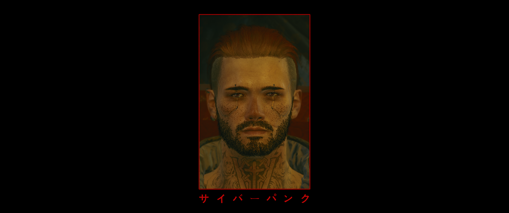
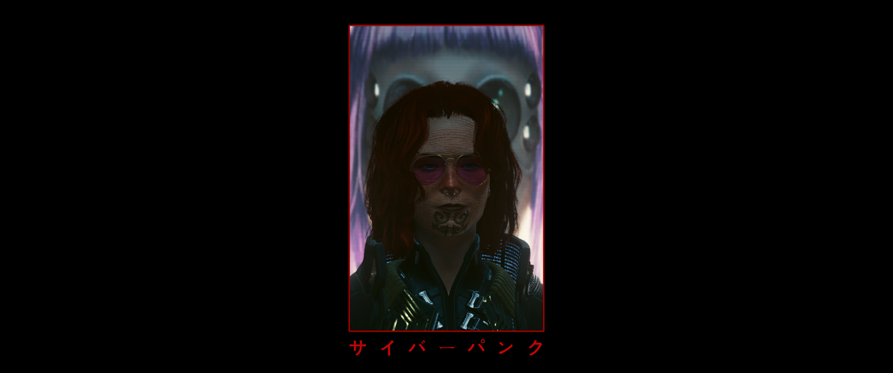
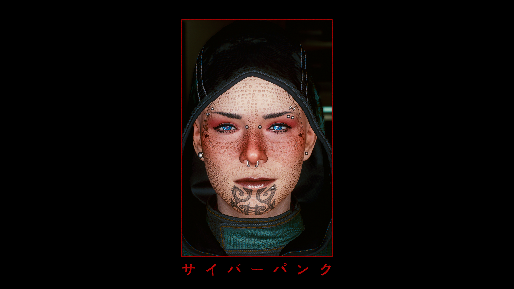
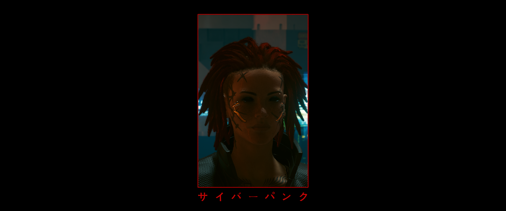
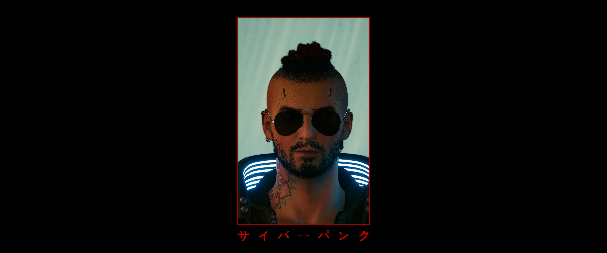
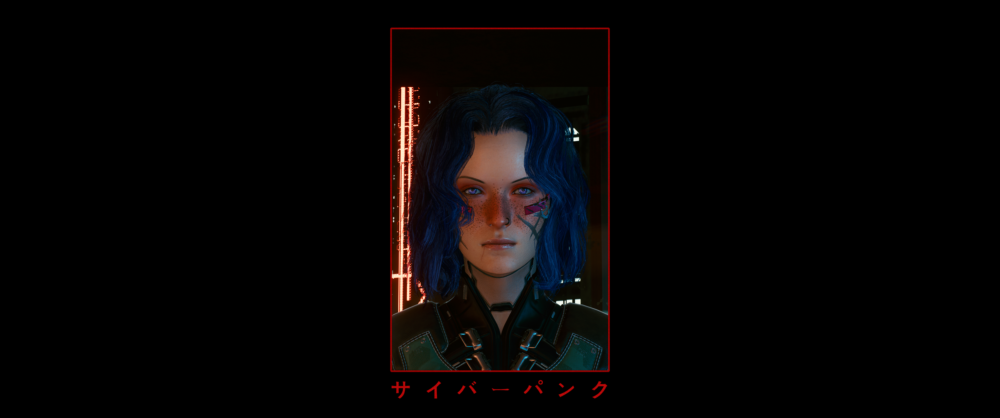

# Cyberpunk 2077 - Preset Pack 1
A collection of character presets i have made for my various Cyberpunk 2077 playthroughs
  
  
## Installation:
### *Please note that cloning the repo directly does not provide the proper file structure for plug-and-play; check out the releases tab*  
1\. Download  
2\. Download dependencies  
3a. Plop the unpacked bin directly into the root folder  
3b. If using Vortex, drag the .zip into vortex  
  
  
## Requirements:
\- \[Hard Requirement\] [Cyber Engine Tweaks (Nexus)](https://www.nexusmods.com/cyberpunk2077/mods/107) / [Cyber Engine Tweaks (GitHub)](https://github.com/maximegmd/CyberEngineTweaks) - Needed for ACU  
\- \[Hard Requirement\] [Appearance Change Unlocker](https://www.nexusmods.com/cyberpunk2077/mods/3850) - Main requirement after CET  
\- \[Soft Requirement\] [E-girl Makeup Edits](https://www.nexusmods.com/cyberpunk2077/mods/1149) - Required for some of the female presets  
\- \[Soft Requirement\] [Kala's Eyes Standalone V2 (Alt V2)](https://www.nexusmods.com/cyberpunk2077/mods/3281) - Required for Nova  
  
  
## Previews
### Nova

### BluV

### William

### Wendy

### Jill

### Jax

### Rebecca

